# AWS Analytics Immersion Day Workshop

이 실습의 목적은 Businesss Intelligence System을 aws의 analytics 서비스를 활용해서 구현해 보는 것 입니다.
이 실습을 통해서 `데이터 수집 -> 저장 -> 분석/처리 -> 시각화` 단계를 aws의 analytics 서비스를 이용해서
어떻게 구축할 수 있는지 경험할 수 있습니다.

## Table of Contents
* [Solutions Architecture Overview](#solutions-architecture-overview)
* [사전 준비 작업](#preliminaries)
* [\[Step-1a\] 입력 데이터를 수신할 Kinesis Data Streams 생성하기](#kinesis-data-streams)
* [\[Step-1b\] 데이터를 S3에 저장하기 위한 Kinesis Data Firehose 생성하기](#kinesis-data-firehose)
* [\[Step-1c\] 데이터 파이프라인 동작 확인 하기](#kinesis-data-pipeline)
* [\[Step-1d\] Athena를 이용해서 데이터 분석 하기](#athena)
* [\[Step-1e\] QuickSight를 이용한 데이터 시각화](#amazon-quicksight-visualization)
* [\[Step-2a\] 실시간 데이터 분석을 위한 Amazon Elasticsearch Service 생성하기](#amazon-es)
* [\[Step-2b\] AWS Lambda Function을 이용해서 실시간 데이터를 ElasticSearch에 수집하기](#amazon-lambda-function)
* [\[Step-2c\] Kibana를 이용한 데이터 시각화](#amazon-es-kibana-visualization)
* [Recap and Review](#recap-and-review)

## <a name="solutions-architecture-overview"></a>Solutions Architecture Overview
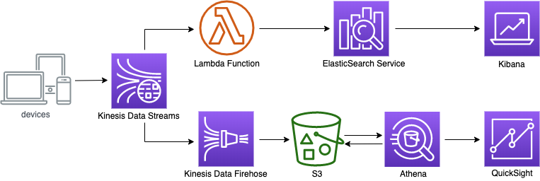

\[[Top](#Top)\]

## <a name="preliminaries"></a>사전 준비 작업
실습을 시작 하기 전에 필요한 IAM User, EC2를 생성하고 및 구성합니다.
 - [실습 환경 준비 하기](./doc_sources/prerequisites.md)
 
\[[Top](#Top)\]

## <a name="kinesis-data-streams"></a>입력 데이터를 수신할 Kinesis Data Streams 생성하기
AWS Management Console에서 Kinesis 서비스를 선택합니다.
1. **Get Started** 버튼을 클릭합니다.
2. **\[Create data stream\]** 버튼을 클릭합니다.
3. Kinesis stream name 에 원하는 이름(예: `retail-trans`)을 입력합니다.
4. Number of shards 에 원하는 shards 수(예: `1`)를 입력합니다.
5. **\[Create data stream\]** 버튼을 클릭 후, 생성된 kinesis stream의 status가 active가 될 때까지 기다립니다.

\[[Top](#Top)\]

## <a name="kinesis-data-firehose"></a>데이터를 S3에 저장하기 위한 Kinesis Data Firehose 생성하기
Kinesis Data Firehose를 이용해서 실시간으로 데이터를 S3, Redshift, ElasticSearch 등의 목적지에 수집할 수 있습니다.
AWS Management Console에서 Kinesis 서비스를 선택합니다.

1. Get Started 버튼을 클릭합니다.
2. Deliver streaming data with Kinesis Firehose delivery streams 메뉴의 **\[Create delivery stream\]** 을 클릭하여
새로운 Firehose 전송 스트림 생성을 시작합니다.
3. (Step 1: Name and source) Delivery stream name에 원하는 이름(예: `retail-trans`)를 입력합니다.
4. **Choose a source** 에서 `Kinesis Data Stream` 를 선택하고, 앞서 생성한 Kinesis Data Stream(예: `retail-trans`)을 선택 한 후,
**Next**를 클릭합니다.
5. (Step 2: Process records) **Transform source records with AWS Lambda / Convert record format** 은 
둘다 default 옵션 `Disabled`를 선택하고 **Next**를 클릭합니다.
6. (Step 3: Choose a destination) Destination은 Amazon S3를 선택하고, `Create new` 를 클릭해서 S3 bucket을 생성합니다.
S3 bucket 이름은 이번 실습에서는 `aws-analytics-immersion-day-xxxxxxxx` 형식으로 `xxxxxxxx` 는 bucket 이름이 겹치지 않도록 임의의 숫자나
문자를 입력 합니다.

    S3 prefix를 입력합니다. 예를 들어서 다음과 같이 입력 합니다.
    
    ```buildoutcfg
    json-data/year=!{timestamp:yyyy}/month=!{timestamp:MM}/day=!{timestamp:dd}/hour=!{timestamp:HH}/
    ```

    S3 error prefix를 입력합니다. 예를 들어서 다음과 같이 입력 합니다.
    ```buildoutcfg
    error-json/year=!{timestamp:yyyy}/month=!{timestamp:MM}/day=!{timestamp:dd}/hour=!{timestamp:HH}/!{firehose:error-output-type}
    ```
    S3 prefix와 3 error prefix 입력을 완료한 후에, Next를 클릭합니다. 
    (참고: https://docs.aws.amazon.com/firehose/latest/dev/s3-prefixes.html)
7. (Step 4: Configure settings) S3 buffer conditions에서 Buffer size는 `1MB`, Buffer interval은 `60` seconds로 설정합니다.
8. 아래 IAM role에서 **\[Create new, or Choose\]** 버튼을 클릭합니다.
9. 새로 열린 탭에서 필요한 정책이 포함된 IAM 역할 `firehose_delivery_role`을 자동으로 생성합니다. Allow 버튼을 클릭하여 진행합니다.
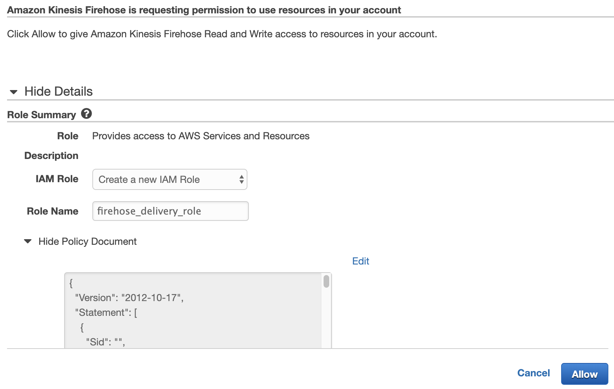
10. 새롭게 생성된 역할이 추가된 것을 확인한 뒤 Next 버튼을 클릭합니다.
11. (Step 5: Review) Review에서 입력한 정보를 확인한 뒤 틀린 부분이 없다면, **\[Create delivery stream\]** 버튼을 클릭하여 Firehose 생성을 완료합니다.

\[[Top](#Top)\]

## <a name="kinesis-data-pipeline"></a>데이터 파이프라인 동작 확인 하기
샘플 데이터를 이용해서 `Kinesis Data Streams -> Kinesis Data Firehose -> S3` 로 데이터가 정상적으로 수집되는지 확인합니다.


1. 앞서 생성한 EC2 인스턴스에 SSH 접속을 합니다.
2. `gen_kinesis_data.py`을 실행합니다.
    ```shell script
    $ python3 gen_kinesis_data.py --help
    usage: gen_kinesis_data.py [-h] [-I INPUT_FILE] [--out-format {csv,tsv,json}]
                               [--service-name {kinesis,firehose}]
                               [--stream-name STREAM_NAME] [--max-count MAX_COUNT]
                               [--dry-run]
    
    optional arguments:
      -h, --help            show this help message and exit
      -I INPUT_FILE, --input-file INPUT_FILE
                            The input file path ex)
                            ./resources/online_retail.csv
      --out-format {csv,tsv,json}
      --service-name {kinesis,firehose}
      --stream-name STREAM_NAME
                            The name of the stream to put the data record into.
      --max-count MAX_COUNT
                            The max number of records to put.
      --dry-run
    
    $ python3 gen_kinesis_data.py -I resources/online_retail.csv \
    --service-name kinesis \
    --out-format json \
    --stream-name retail-trans
    ```
3. 매 초 데이터가 발생하는 것을 확인합니다. 충분한 데이터 수집을 위해 실행 중인 상태로 다음 단계를 진행합니다.
4. 몇 분 뒤 생성한 S3 bucket을 확인해 보면, 생성된 원본 데이터가 Kinesis Data Firehose를 통해 S3에 저장되는 것을 확인할 수 있습니다. 

\[[Top](#Top)\]

## <a name="athena"></a>Athena를 이용해서 데이터 분석 하기
Amazon Athena를 이용해서 S3에 저장된 데이터를 기반으로 테이블을 만들고, 테이블을 쿼리한 다음 쿼리 결과를 확인할 수 있습니다.
먼저 데이터를 쿼리하기 위해서 데이터베이스를 생성합니다.


### 1단계: 데이터베이스 생성
1. Athena 콘솔을 엽니다.
2. Athena 콘솔을 처음 방문하면 시작하기 페이지로 이동합니다. **\[Get Started\]** 를 선택해 쿼리 편집기를 엽니다. 
처음 방문하는 경우가 아니라면 Athena 쿼리 편집기가 열립니다.
3. Athena 쿼리 편집기에서 예제 쿼리가 있는 쿼리 창을 볼 수 있습니다. 쿼리 창의 아무 곳에나 쿼리를 입력하기 시작합니다.
4. `mydatabase` 라는 데이터베이스를 생성하려면 다음 CREATE DATABASE 문을 입력한 다음, **\[Run Query\]** 를 선택합니다.
    ```buildoutcfg
    CREATE DATABASE mydatabase
    ```
5. 카탈로그 디스플레이가 새로 고쳐지고 왼쪽 **\[Catalog\]** 대시보드의 **\[DATABASE\]** 목록에 `mydatabase`가 표시되는지 확인합니다.

### 2단계: 테이블 생성
1. **\[DATABASE\]** 에 `mydatabase`가 선택되었는지 확인한 후 **\[New Query\]** 를 선택합니다.
2. 쿼리 창에 다음 CREATE TABLE 문을 입력한 후 **\[Run Query\]** 를 선택합니다.
    ```buildoutcfg
    CREATE EXTERNAL TABLE `mydatabase.retail_trans_json`(
      `invoice` string COMMENT 'Invoice number', 
      `stockcode` string COMMENT 'Product (item) code', 
      `description` string COMMENT 'Product (item) name', 
      `quantity` int COMMENT 'The quantities of each product (item) per transaction', 
      `invoicedate` timestamp COMMENT 'Invoice date and time', 
      `price` float COMMENT 'Unit price', 
      `customer_id` string COMMENT 'Customer number', 
      `country` string COMMENT 'Country name')
    PARTITIONED BY ( 
      `year` int, 
      `month` int, 
      `day` int, 
      `hour` int)
    ROW FORMAT SERDE 
      'org.openx.data.jsonserde.JsonSerDe' 
    STORED AS INPUTFORMAT 
      'org.apache.hadoop.mapred.TextInputFormat' 
    OUTPUTFORMAT 
      'org.apache.hadoop.hive.ql.io.IgnoreKeyTextOutputFormat'
    LOCATION
      's3://aws-analytics-immersion-day-xxxxxxxx/json-data'
    ```
    테이블 `retail_trans_json`가 생성되고 데이터베이스의 **\[Catalog\]** 대시보드에 표시됩니다.
3. 테이블을 생성한 이후 **\[New Query\]** 를 선택하고 다음을 실행해서, 파티션의 데이터를 로드합니다.
    ```buildoutcfg
    MSCK REPAIR TABLE mydatabase.retail_trans_json
    ```

### 3단계: 데이터 쿼리
1. **\[New Query\]** 를 선택하고 쿼리 창의 아무 곳에나 다음 문을 입력한 다음 **\[Run Query\]** 를 선택합니다.
    ```buildoutcfg
    SELECT *
    FROM retail_trans_json
    LIMIT 10
    ```
다음과 같은 형식의 결과가 반환됩니다.


\[[Top](#Top)\]

## <a name="amazon-quicksight-visualization"></a>QuickSight를 이용한 데이터 시각화
이번에는 Amazon Quicksight를 통해 데이터 시각화 작업을 합니다.


1. [QuickSight 콘솔](https://quicksight.aws.amazon.com)로 이동합니다.
2. QuickSight에 가입하기 위해 **\[Sign up for QuickSight\]** 버튼을 클릭합니다.
3. Standard Edition을 선택한 후 **\[Continue\]** 버튼을 클릭합니다.
4. QuickSight account name은 임의로 지정(중복될 경우 계정이 생성되지 않습니다) 하고,
Notification email address는 개인 Email 주소를 입력합니다.
QuckSight가 S3에 Access해야 하므로, **\[Choose S3 buckets\]** 를 클릭하여,
`aws-analytics-immersion-day-xxxxxxxx` 를 선택한 후 **\[Finish\]** 를 클릭합니다.
5. 계정이 생성된 후 **\[Go to Amazon QuickSight\]** 버튼을 클릭합니다.
6. 우측 상단에 region이 데이터를 저장하고 있는 S3 bucket의 region과 동일하게 설정한 후, 
좌측 상단 **\[New Analysis\]** 를 클릭합니다.
7. **\[New Data Set\]** 버튼을 클릭합니다.
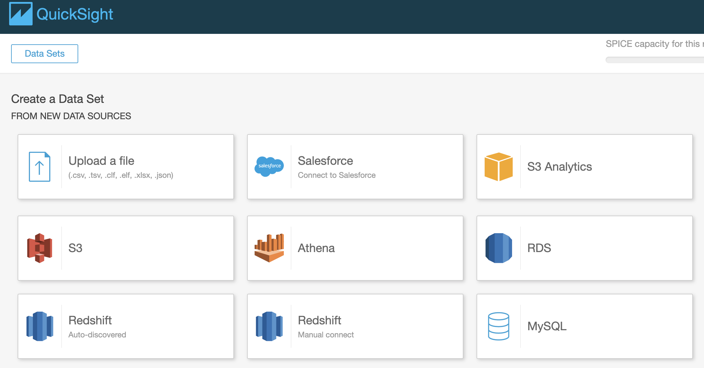
8. `Athena` 를 클릭하고 팝업 창의 Data source name에 `retail-quicksight` 를 입력(임의의 값 입력 가능)하고,
**\[Validate connection\]** 을 클릭 해서 `Validated` 상태로 변경되면, **\[Create data source\]** 버튼을 클릭합니다.
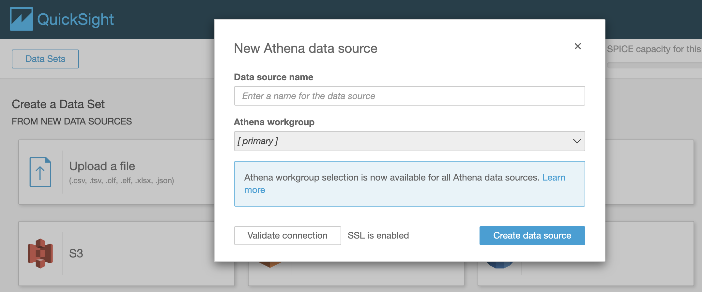
9. Choose your table 화면에서 Database는 `mydatabase` (앞서 생성한 Athena 데이터베이스),
Tables 에서 `retail_trans_json` 를 선택하고 Select 버튼을 클릭합니다.
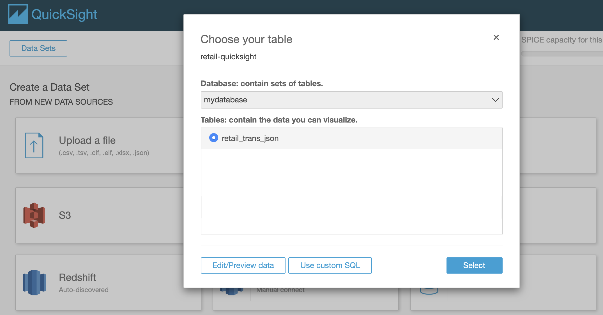
10. Finish data set creation 화면에서 **\[Visualize\]** 버튼을 클릭 합니다.
`retail_trans_json` 테이블 데이터가 QuickSight SPICE 엔진에 로딩 되었는지 확인합니다.
11. `InvoicdDate` 별 `Quantity`, `Price`를 시각화 해 보겠습니다. 좌측 Fields list에서 `invoicedate`, `price`, `quantity` field를 차례대로 선택합니다.
Visual types는 세로 막대 그래프를 선택합니다.
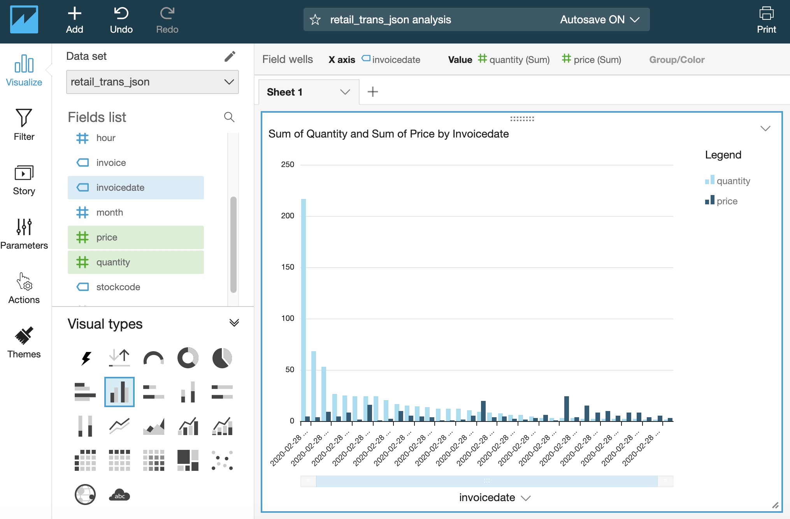
12. 그래프 상단 invoicedate 를 클릭하고 \[Aggregate: Day\]를 **Quarter** 로 변경합니다.
13. 분기별로 데이터가 집계 되었습니다.
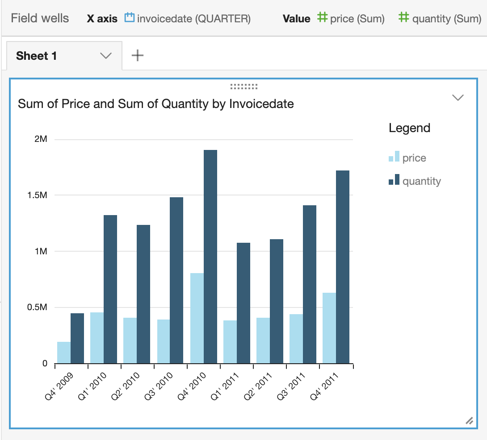
14. 방금 만든 Dashboard를 다른 사용자에게 공유해 보겠습니다. 좌측 상단 유저 아이콘을 클릭하고 \[Manage QuickSight\] 를 클릭합니다.
15. Invite users 버튼을 클릭한 후 임의의 사용자 계정명(BI_user01)을 입력한 후 우측 [+] 버튼을 클릭합니다.
Email은 다른 사용자의 Email 주소를 입력하고 Role은 AUTHOR, IAM User는 NO를 선택한 후 Invite 버튼을 클릭합니다.
16. 사용자는 다음과 같은 Invitation Email을 받고 Click to accept invitation을 클릭하면 계정 생성 메뉴에서 비밀번호를 변경할 수 있습니다.
17. QuickSight 화면으로 돌아가서 우측 상단의 Share > Share analysis를 클릭합니다.
18. BI_user01을 선택한 후 Share 버튼을 클릭합니다.
19. 사용자는 다음과 같은 Email을 수신합니다. **\[Click to View\]** 를 클릭하여 분석결과를 확인할 수 있습니다.

\[[Top](#Top)\]

## <a name="amazon-es"></a>실시간 데이터 분석을 위한 Amazon Elasticsearch Service 생성하기
실시간으로 데이터를 저장하고, 분석하기 위해서 Elasticsearch cluster를 생성합니다.
Amazon ES 도메인은 Elasticsearch 클러스터와 동의어입니다. 도메인은 설정, 인스턴스 유형, 인스턴스 수, 스토리지 리소스를 지정한 설정입니다.


**Amazon ES 도메인을 만들려면(콘솔)**
1. AWS Management Console에서 Analytics의 **Elasticsearch** 서비스를 선택합니다.
2. (Step 1: Choose deployment type) **Create a new domain(새 도메인 생성)** 을 선택합니다.
3. **Elasticsearch 도메인 생성** 페이지에서 **Deployment type(배포 유형)** 에 대해 **Production(프로덕션)** 을 선택합니다.
4. **버전**에서 해당 도메인의 Elasticsearch 버전을 선택합니다. 지원되는 최신 버전을 선택하는 것이 좋습니다. 자세한 내용은 지원되는 Elasticsearch 버전 단원을 참조하십시오.
5. **\[Next\]** 를 선택합니다.
6. (Step 2: Configure domain) 도메인의 이름을 입력합니다. 이 실에서는 이후에 다룰 `retail`를 예제 도메인 이름으로 사용합니다.
7. **인스턴스 유형** 에서 Amazon ES 도메인의 인스턴스 유형을 선택합니다. 이 실습에서는 테스트 목적에 적합한 소용량의 경제적인 인스턴스 유형
`t2.small.elasticsearch`를 사용하는 것이 좋습니다.
8. **인스턴스 수** 에 원하는 인스턴스 수를 입력합니다. 이 실습에서는 기본값 `1`을 사용합니다.
9. 스토리지 유형에서 EBS를 선택합니다.
- a. EBS volume type(EBS 볼륨 유형)에 일반용(SSD)을 선택합니다. 자세한 내용은 Amazon EBS 볼륨 유형을 참조하십시오.
- b. EBS volume size(EBS 볼륨 크기)에 각 데이터 노드용 외부 스토리지의 크기를 GiB 단위로 입력합니다. 이 실습에서는 기본값 `10`을 사용합니다.
10. 지금은 **Dedicated master nodes(전용 마스터 노드), Snapshot configuration(스냅샷 구성)** 및 **Optional Elasticsearch cluster settings(선택적 Elasticsearch 클러스터 설정)** 섹션을 무시할 수 있습니다.
11. **\[Next\]** 를 선택합니다.
12. (Step 3: Configure access and security) **Network configuration(네트워크 구성)** 의 경우 **VPC access** 를 선택합니다.
적절한 VPC와 subnet을 선택합니다. Security Groups으로 준비 단계에서 생성한 `es-cluster-sg`를 선택합니다.
13. 지금은 **Amazon Cognito Authentication(Amazon Cognito 인증)** 과 **Fine–grained access control** 을 disable 합니다.
14. **Access policy(액세스 정책)** 의 경우 **Domain access policy(도메인 액세스 정책)** 에서 **JSON defined access policy(JSON 정의 액세스 정책)** 선택한 다음,
**Add or edit the access policy(액세스 정책 추가 또는 편집)** 에 아래와 같이 입력합니다.
    ```json
    {
      "Version": "2012-10-17",
      "Statement": [
        {
          "Effect": "Allow",
          "Principal": {
            "AWS": "*"
          },
          "Action": [
            "es:Describe*",
            "es:List*",
            "es:Get*",
            "es:ESHttp*"
          ],
          "Resource": "arn:aws:es:::domain/retail/*"
        }
      ]
    }
    ```
15. **Encryption(암호화)** 에서 **Require HTTPS for all traffic to the domain** 만 허용하고, 다른 항목은 disable 합니다.
16. **Encryption(암호화)** 의 모든 기본값을 유지합니다. **\[Next\]** 를 선택합니다.
17. **Review** 페이지에서 도메인 구성을 검토한 다음 **확인**을 선택합니다.

\[[Top](#Top)\]

## <a name="amazon-lambda-function"></a>AWS Lambda Function을 이용해서 실시간 데이터를 ElasticSearch에 수집하기
Lambda function을 이용해서 Amazon ES에 데이터를 실시간으로 색인할 수 있습니다.
이번 실습에서는 AWS Lambda 콘솔을 사용하여 Lambda 함수를 생성합니다.

### Lambda 함수에서 사용할 공통 라이브러를 Layers에 추가하려면,
1. **AWS Lambda 콘솔** 을 엽니다.
2. **Layers** 메뉴에 들어가서 **\[Create layer\]** 을 선택합니다.
3. Name에 `es-lib` 를 입력합니다.
4. `Upload a file from Amazon S3` 를 선택하고, 라이브러리 코드가 저장된 s3 link url 또는 압축한 라이브러리 코드 파일을 입력합니다.
(참고로 이 실습에서는 `resources/es-lib.zip` 파일을 사용합니다.)
5. `Compatible runtimes` 에서 `Python 3.8` 을 선택합니다.
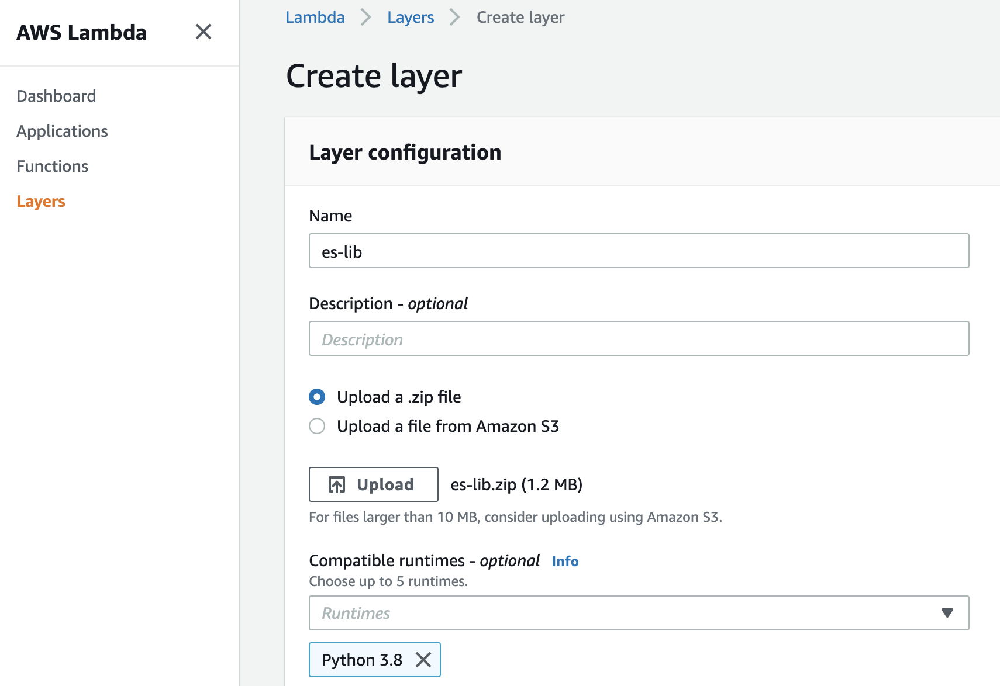

### Lambda 함수를 생성하려면,
1. **AWS Lambda 콘솔** 을 엽니다.
2. **\[Create a function\]** 을 선택합니다.
3. Function name(함수 이름)에 `UpsertToES` 을 입력합니다.
4. Runtime 에서 `Python 3.8` 을 선택합니다.
5. **\[Create a function\]** 을 선택합니다.
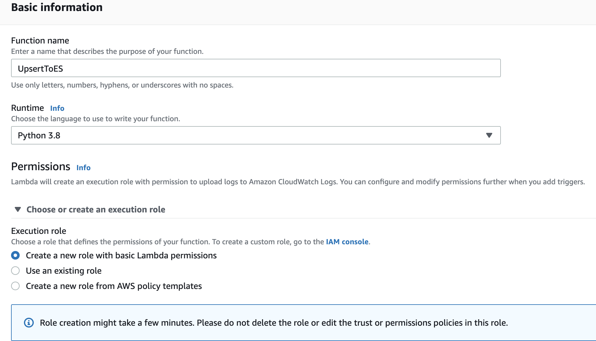
6. Designer(디자이너) 에서 layers를 선택합니다. Layers에서 Add a layer를 선택합니다.
7. Layer selection에서 `Select from list of runtime compatible layers`을 클릭하고, 
Compatiable layers에서 Name과 Version으로 앞서 생성한 layer의 Name과 Version을 선택합니다.
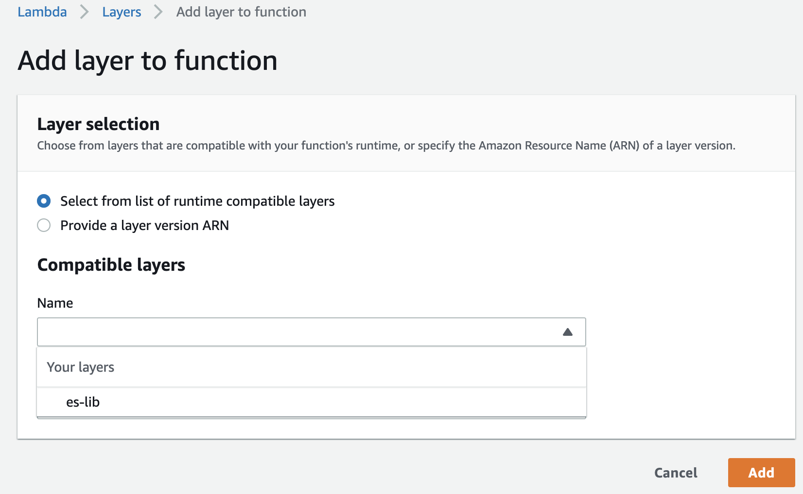
Layer의 runtime 버전과 Lambda function의 runtime이 버전이 다른 경우, Layer selection의 Compatiable layers에 필요한 layer가
목록에 보이지 않을 수 있습니다. 
이러한 경우, Layer selection에서 `Provide a layer version ARN`을 클릭하고,
layer의 arn을 직접 입력하면 됩니다.
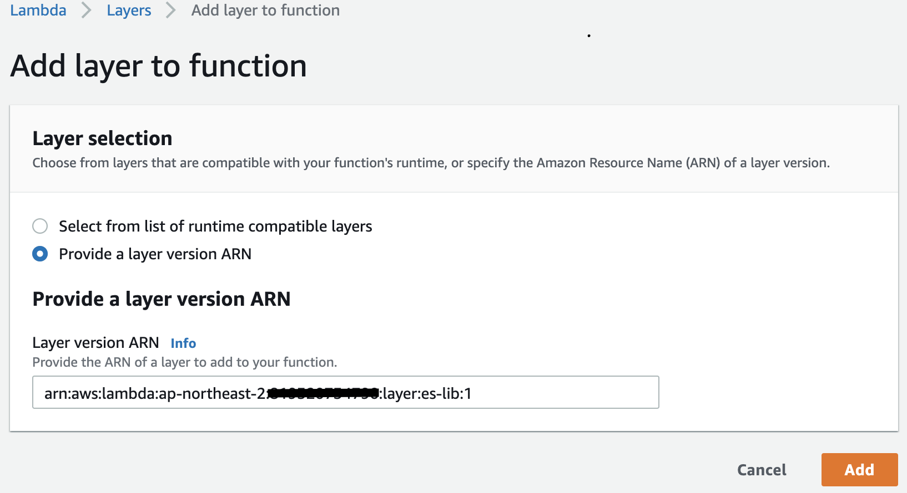
8. **\[Add\]** 클릭합니다.
9. Designer(디자이너) 에서 `UpsertToES` 을 선택하여 함수의 코드 및 구성으로 돌아갑니다.
10. Function code의 코드 편집기에 `upsert_to_es.py` 파일의 코드를 복사해서 붙여넣습니다.
11. Environment variables 에서 **\[Edit\]** 를 클릭합니다.
12. **\[Add environment variables\]** 를 클릭해서 아래 4개의 Environment variables을 등록합니다.
    ```shell script
    ES_HOST=<elasticsearch service domain>
    REQUIRED_FIELDS=Invoice,StockCode,Customer_ID
    REGION_NAME=<region-name>
    DATE_TYPE_FIELDS=InvoiceDate
    ```
    예를 들어, 다음과 같이 Environment variables을 설정합니다.
    ```buildoutcfg
    ES_HOST=vpc-retail-xkl5jpog76d5abzhg4kyfilymq.us-west-1.es.amazonaws.com
    REQUIRED_FIELDS=Invoice,StockCode,Customer_ID
    REGION_NAME=us-west-1
    DATE_TYPE_FIELDS=InvoiceDate
    ```
13. **\[Save\]** 선택합니다.
14. lambda 함수를 VPC 내에서 실행 하고, Kinesis Data Streams에서 데이터를 읽기 위해서,
lamba 함수 실행에 필요한 Execution role에 필요한 IAM Policy를 추가햐야 합니다.
IAM Role 수정을 위해서 `View the UpsertToES-role-XXXXXXXX role on the IAM console.` 을 클릭 합니다.
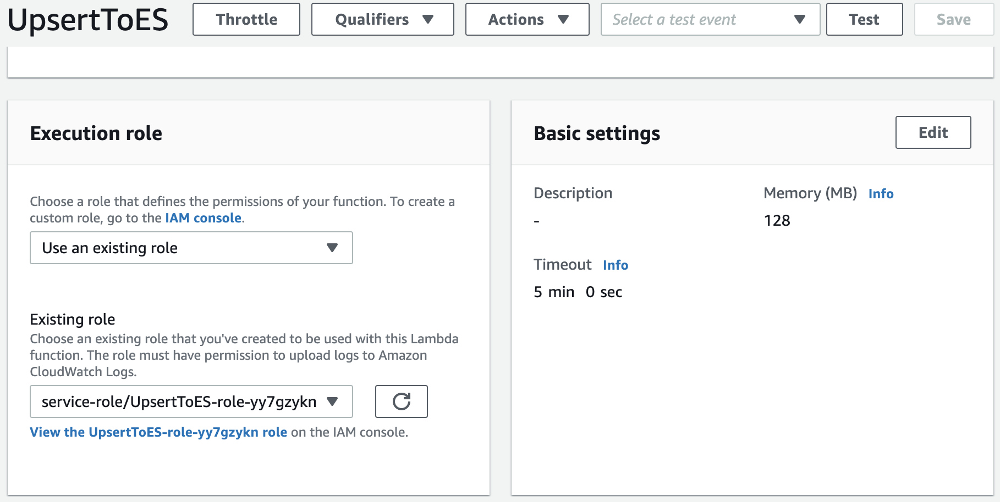
15. IAM Role의 **\[Permissions\]** 탭에서 **\[Attach policies\]** 버튼을 클릭 후, 
**AWSLambdaVPCAccessExecutionRole**, **AmazonKinesisReadOnlyAccess** 를 차례로 추가 합니다.
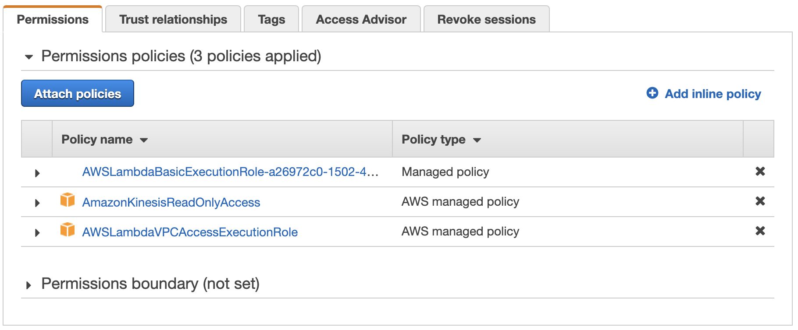
16. VPC 항목에서 **\[Edit\]** 버튼을 클릭해서 Edit VPC 화면으로 이동 한다. VPC connection 에서 `Custom VPC` 를 선택합니다.
Elasticsearch service의 도메인을 생성한 VPC와 subnets을 선택하고, Elasticsearch service 도메인에 접근이 허용된
security groups을 선택합니다.
17. Basic settings에서 **\[Edit\]** 선택합니다. Memory와 Timeout을 알맞게 조정합니다. 이 실습에서는 Timout을 `5 min` 으로 설정합니다.
18. 다시 Designer 탭으로 돌아가서 **\[Add trigger\]** 를 선택합니다.
19. **Trigger configuration** 의 `Select a trigger` 에서 **Kinesis** 를 선택 합니다.
20. Kinesis stream 에서 앞서 생성한 Kinesis Data Stream(`retail-trans`)을 선택합니다.
21. **\[Add\]** 를 선택합니다.
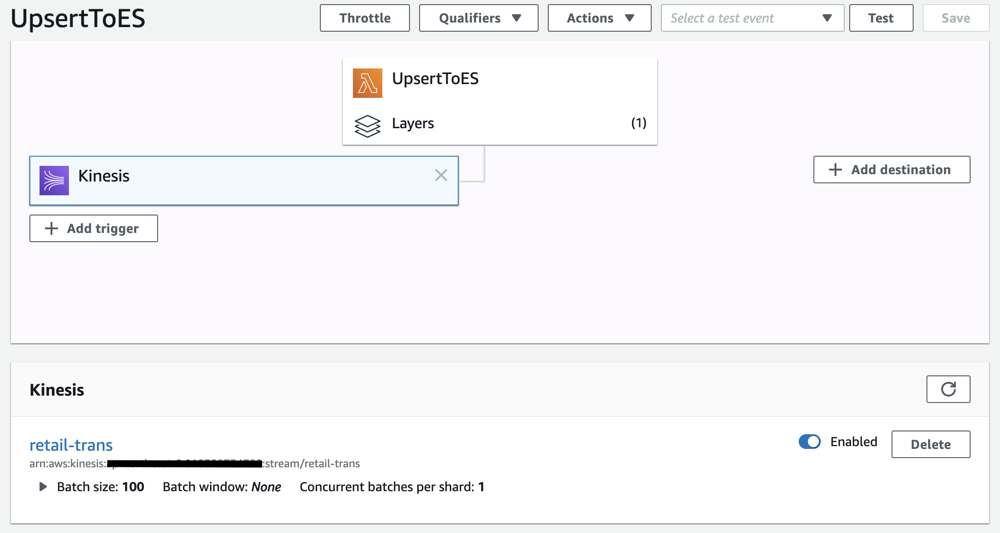

\[[Top](#Top)\]

## <a name="amazon-es-kibana-visualization"></a>Kibana를 이용한 데이터 시각화
Amazon Elasticsearch Service에서 수집된 데이터를 Kibana를 이용해서 시각화 작업을 합니다.


1. Elasticsearch Cluster에 접속하기 위해서 ssh config에 ssh 설정을 한다.
    ```shell script
    # Elasticsearch Tunnel
    Host estunnel
      HostName <EC2 Public IP>
      User ec2-user
      IdentitiesOnly yes
      IdentityFile ~/.ssh/analytics-hol.pem
      LocalForward 9200 <Elasticsearch Endpoint>:443
    ```
2. Terminal 에서 `ssh -N estunnel` 를 실행합니다.
3. Web browser에서 `https://localhost:9200/_plugin/kibana/` 으로 접속합니다.
4. (Home) Add Data to Kibana 에서 **\[Use Elasticsearch data / Connect to your Elasticsearch index\]** 클릭한다.
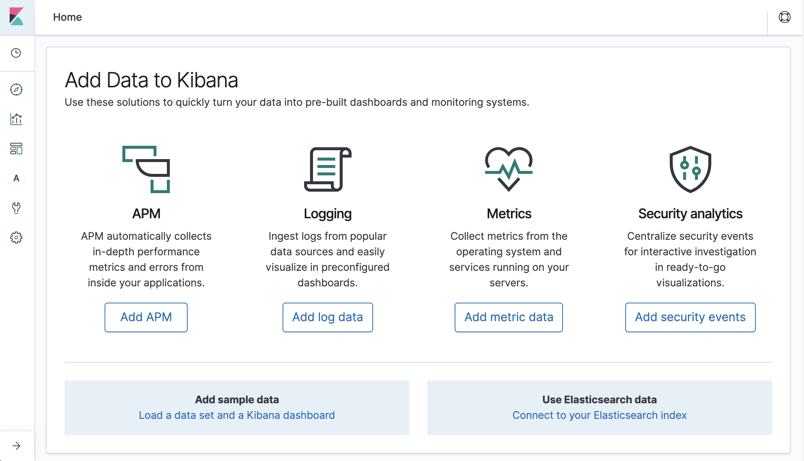
5. (Management / Create index pattern) Create index pattern의 **Step 1 of 2: Define index pattern** 에서
Index pattern에 `retail*` 을 입력합니다.
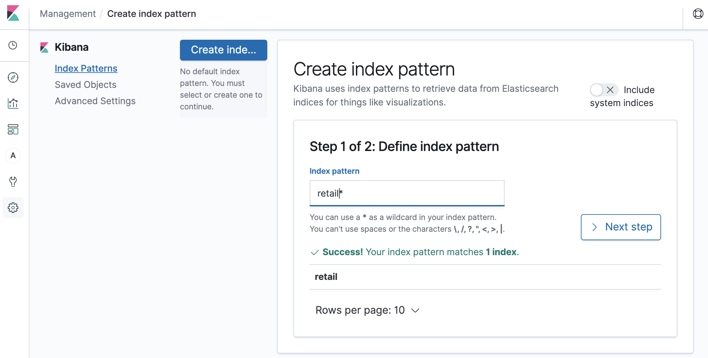
6. (Management / Create index pattern) **\[> Next step\]** 을 선택합니다.
7. (Management / Create index pattern) Create index pattern의 **Step 2 of 2: Configure settings** 에서
Time Filter field name에 `InvoiceDate` 를 선택합니다.
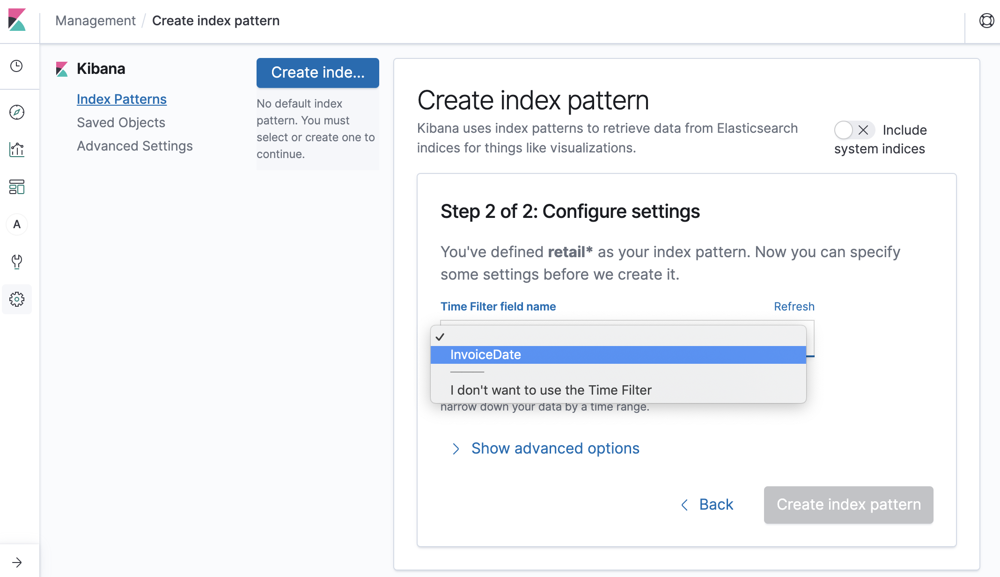
8. (Management / Create index pattern) **\[Create index pattern\]** 을 클릭합니다.
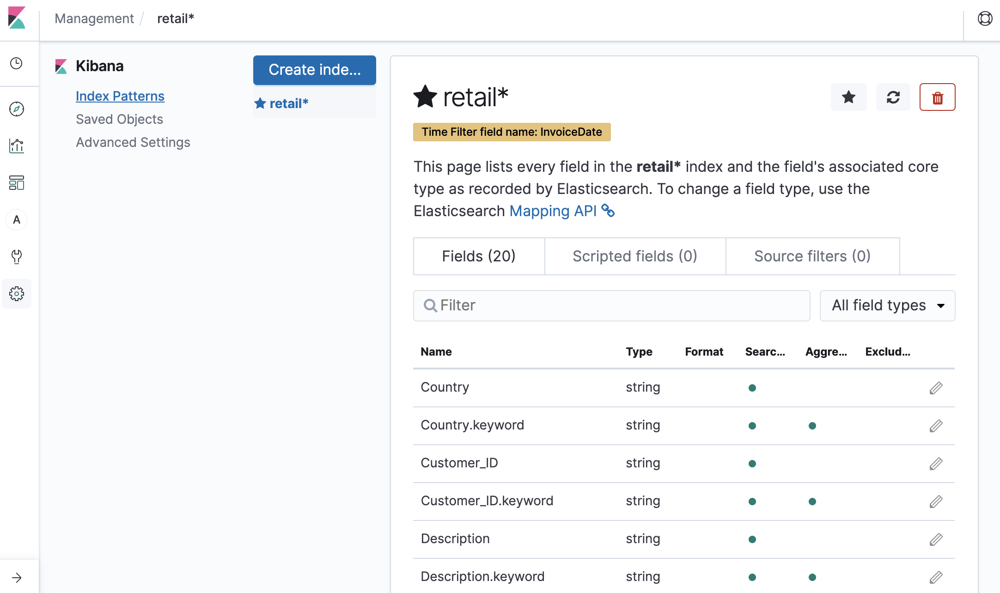
9. (Discover) Index pattern 생성을 완료 후, Discover를 선택해서 Elasticsearch 수집된 데이터를 확인합니다.

10. (Discover) `InvoicdDate` 별 `Quantity`를 시각화 해 보겠습니다. 좌측의 Available fields에서 invoicdDate를
선택하고, 하단에 있는 Visualize를 클릭합니다.
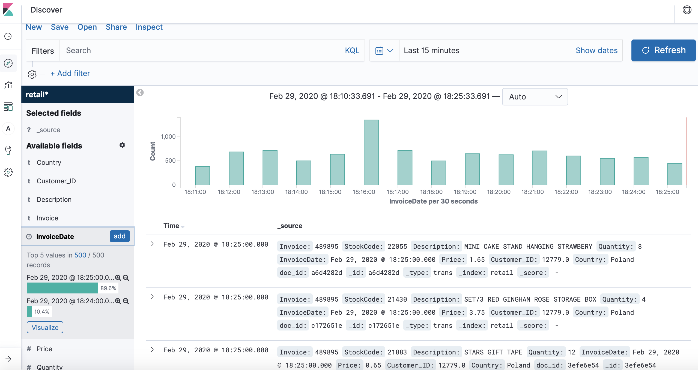
11. (Visualize) 아래와 같이 Data 탭의 Metrics에서 Y-Axis를 Aggregation은 `Sum`, Field는 `Quantity`를 선택 후 적용 합니다.
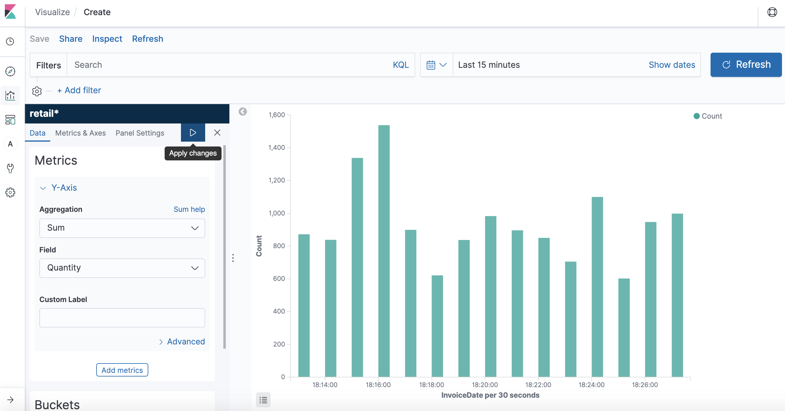
12. (Visualize) 좌측 상단의 **\[Save\]** 를 클릭하고, 저장한 그래프의 이름을 적은 후에 **\[Confirm Save\]** 를 클릭합니다.

13. (Dashboards) 좌측의 Dashboard 아이콘을 클릭 후, **\[Create new dashboard\]** 버튼을 클릭 합니다.
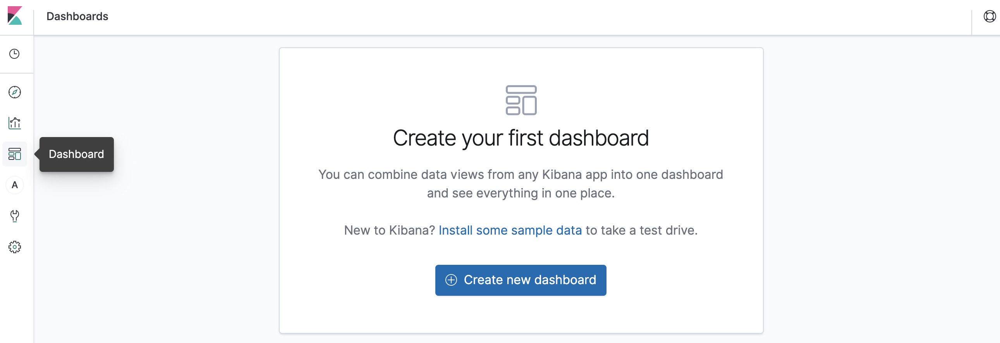
14. (Dashboards) 좌측 상단의 **\[Add\]** 를 클릭해서, **Add Panels** 에 이전 단계에서 생성한 그래프를 선택 합니다.

15. (Dashboards) 좌측 상단의 **\[Save\]** 를 클릭 한 후, Save dashboard에서 Title을 입력한 이후, **\[Confirm Save\]** 를 클릭 합니다.

16. (Dashboards) 아래와 같은 Dashboard를 확인할 수 있습니다.


\[[Top](#Top)\]

## Recap and Review
이 실습을 통해서 데이터 파이프라인을 만들어서 실시간 데이터 처리와 배치 데이터 처리 layer로 구성된
Lambda Architecture 구조의 Business Intelligent System을 구축해 보셨습니다.

\[[Top](#Top)\]
